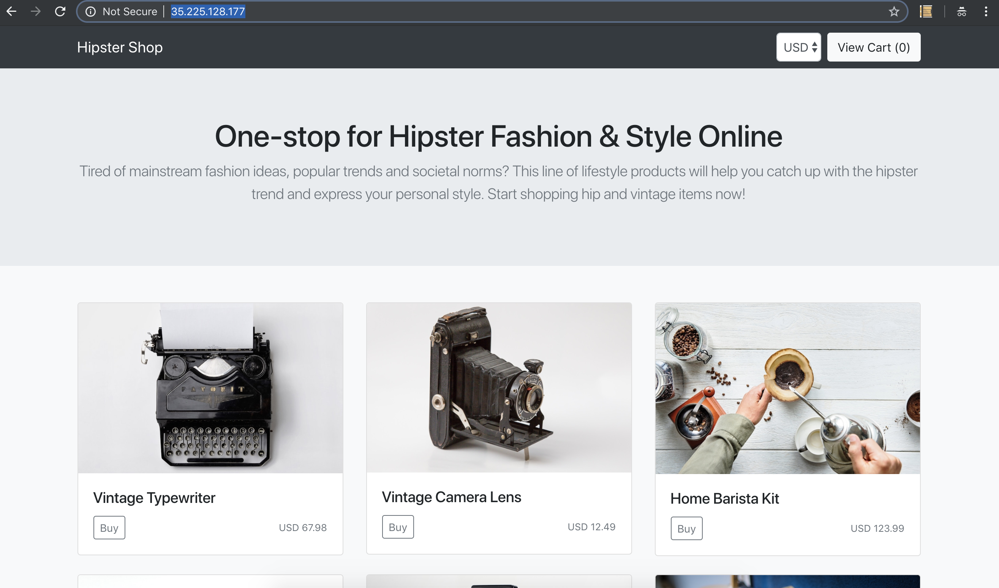
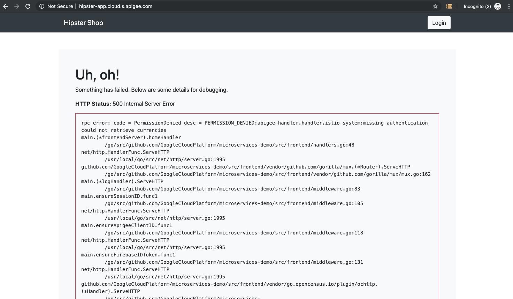
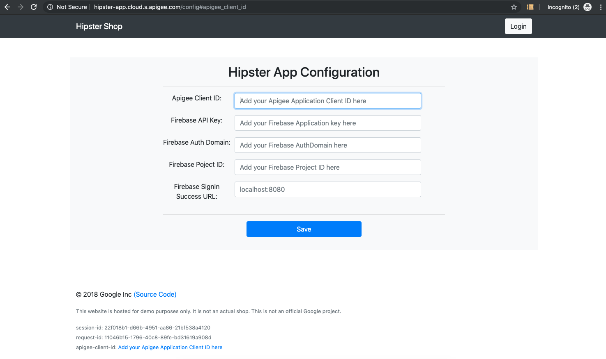

# Hipster API Demo

## Install

#### Tool Prerequisites

`gcloud`
`kubectl`
`apigee-istio`

#### Information Prerequisite
Set your Google Cloud Project ID

```
export PROJECT_ID=<gcp-project-id>
export ZONE=us-central1-a
export CLUSTER_NAME=my-cluster
```

#### Download the repo
```
export HIPSTER_VERSION=1.1.0

mkdir -p hipster-apim-demo && cd hipster-apim-demo && curl -L https://github.com/mukundha/hipster-apim-demo/archive/$HIPSTER_VERSION.tar.gz | tar xvz --strip-components=1
```

##### Setup GKE

```
gcloud config set project ${PROJECT_ID}

gcloud container clusters create ${CLUSTER_NAME} \
    --machine-type=n1-standard-2 \
    --num-nodes 3 \
    --enable-autoscaling --min-nodes 1 --max-nodes 10 \
    --cluster-version=1.13 \
    --zone=${ZONE} \
    --no-enable-legacy-authorization

gcloud container clusters get-credentials ${CLUSTER_NAME} --zone=${ZONE}

kubectl create clusterrolebinding cluster-admin-binding \
  --clusterrole=cluster-admin \
  --user="$(gcloud config get-value core/account)"

```


##### Install Istio
```
curl -L https://git.io/getLatestIstio | ISTIO_VERSION=1.1.7 sh -

cd istio-1.1.7

for i in install/kubernetes/helm/istio-init/files/crd*yaml; do kubectl apply -f $i; done

kubectl apply -f install/kubernetes/istio-demo.yaml

#wait for pods to be running / completed, takes about a minute or two
watch kubectl get pods -n istio-system

cd ..

```

##### Prepare for Demo (Required only for this demo)
```
gcloud compute disks create --size=1GB --zone=${ZONE} istio-disk

kubectl apply -f demo/setup-persistent-disk.yaml

watch kubectl get job setup-persistent-disk
#wait for the job to complete

kubectl delete -f demo/setup-persistent-disk.yaml

#update the sidecar injector to mount the gce disk created earlier to side car proxies
kubectl apply -f demo/istio-sidecar-injector.yaml

kubectl label namespace default istio-injection=enabled

```

#### Install Hispter
```
kubectl apply -f demo/istio-manifests.yaml

kubectl apply -f demo/kubernetes-manifests.yaml

#wait for pods to be running , takes about a minute
watch kubectl get pods

#filter for grpc-transcoding
kubectl apply -f demo/filter.yaml

```

### Test

```
export GATEWAY_URL=http://$(kubectl -n istio-system get service istio-ingressgateway -o jsonpath='{.status.loadBalancer.ingress[0].ip}')

#Get Ads
curl $GATEWAY_URL/ads

#Get Recommendations
curl $GATEWAY_URL/recommendations/1

#Get Currencies
curl $GATEWAY_URL/currencies

#Get List of Products
curl $GATEWAY_URL/products

```
Explore the API endpoints in folder `specs/demo.http.swagger.json`


### Apigee Demo

#### Install Apigee Adapter

```
#This section assumes, you are running these steps from a Google Cloud shell, if you are running it on your own machine, make sure you download the correct binary for the apigee adapter depending on your OS

export APIGEE_ISTIO_DIR=istio-mixer-adapter;

export APIGEE_ISTIO_DOWNLOAD_URL=https://github.com/apigee/istio-mixer-adapter/releases/download/1.1.3/istio-mixer-adapter_1.1.3_linux_64-bit.tar.gz;

mkdir -p $APIGEE_ISTIO_DIR && cd $APIGEE_ISTIO_DIR && curl -L $APIGEE_ISTIO_DOWNLOAD_URL | tar xvz

./apigee-istio provision --grpc -o [org] -e [env] -u [username] -p [password] > samples/apigee/grpc/handler.yaml

kubectl apply -f samples/apigee/grpc/apigee-adapter.yaml
kubectl apply -f samples/apigee/grpc/definitions.yaml
kubectl apply -f samples/apigee/grpc/handler.yaml

cd ..
```

#### Enable API Key based Authentication
```
kubectl apply -f demo/rule.yaml

#Get List of Products or other URLs to get ads, or currencies we used earlier
curl $GATEWAY_URL/products

#The above will fail with HTTP 403
```

Follow instructions [here](https://docs.apigee.com/api-platform/istio-adapter/install-istio_1_1#get_an_api_key) to get a valid API Key and access the APIs


#### Hipster App client Apigee Demo

```
# Disable the Apigee Mixer plugin rule if enabled earlier
kubectl delete -f demo/rule.yaml

# Export FRONTEND_URL to navigate to Hipster App
export FRONTEND_URL=http://$(kubectl get service frontend-external -o jsonpath='{.status.loadBalancer.ingress[0].ip}')
```

* Launch the FRONTEND_URL in a modern browser (Chrome/Safari/Firefox) and navigate around the Hipster Shop. For OSX `open $FRONTEND_URL`
  * _This will succeed without any errors_



```
#Re-apply the Apigee Mixer plugin rule to enforce authorization
kubectl apply -f demo/rule.yaml
```
* Navigate around the Hipster Shop again in your browser.
  * _This will partially fail with HTTP 500 and HTTP 403 errors_



* Generate a Developer and an API Product with the appropriate service names [example](https://docs.apigee.com/api-platform/istio-adapter/installation#get_an_api_key). You will need to add at least the following to the API Product Istio Services:
```
productcatalogservice.default.svc.cluster.local
recommendationservice.default.svc.cluster.local
currencyservice.default.svc.cluster.local
cartservice.default.svc.cluster.local
```

* Create an Apigee application with the above API Product either in the Management UI or an Apigee developer portal [example](https://docs.apigee.com/api-platform/istio-adapter/installation#4_create_a_developer_app)

* Copy the Apigee application Client ID above, add the Client ID to the Hipster App configuration, and click the **Save** button. `$FRONTEND_URL/config`



* Navigate around the Hipster Shop again in your browser!
  * _This will succeed without any errors for the services you added to the API Product_


### KNOWN ISSUES

### 1, Transcoding Not working
When you invoke `curl $GATEWAY_URL/ads` or other URLs, you get a errors like
- `GET without QUERY`
- `unable to connect upstream`
indicate the filter is not applied correctly or the disk volume containing the proto descriptor is not mounted correctly.

##### Check Disk Volume mounted correctly
Try this on one of the pods, ads or currency or products and make sure the `gce` folder exists
```
kubectl exec -it <pod-name> sh -c istio-proxy
ls gce
```
If `gce` is not present, there could be a volume mount issue or sidecar injector not applied correctly

##### Check Filter is applied correctly
```
kubectl port-forward <pod> 15000
```
Open localhost:15000 on your browser and searchh for grpc.transcoder, you should find filter configurations, if not filter is not configured correctly.

For both the above cases, try the following
```
kubectl label namespace default istio-injection-

kubectl apply -f demo/istio-sidecar-injector.yaml

kubectl label namespace default istio-injection=enabled

kubectl delete -f demo/kubernetes-manifests.yaml

kubectl apply -f demo/kubernetes-manifests.yaml

#wait for pods to be running , takes about a minute
watch kubectl get pods

#filter for grpc-transcoding
kubectl apply -f demo/filter.yaml

```

### 2, API Key verification not working for Recommendations service
This is a known issue, looks like path matching is failing, pls use other services for demo

