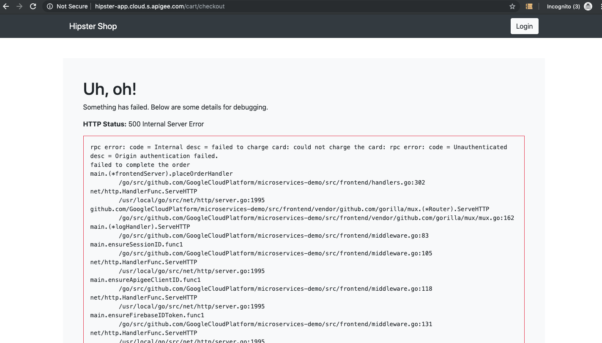
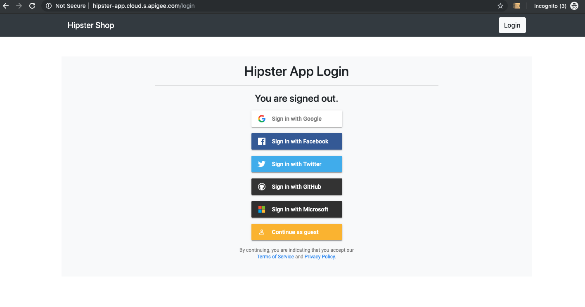
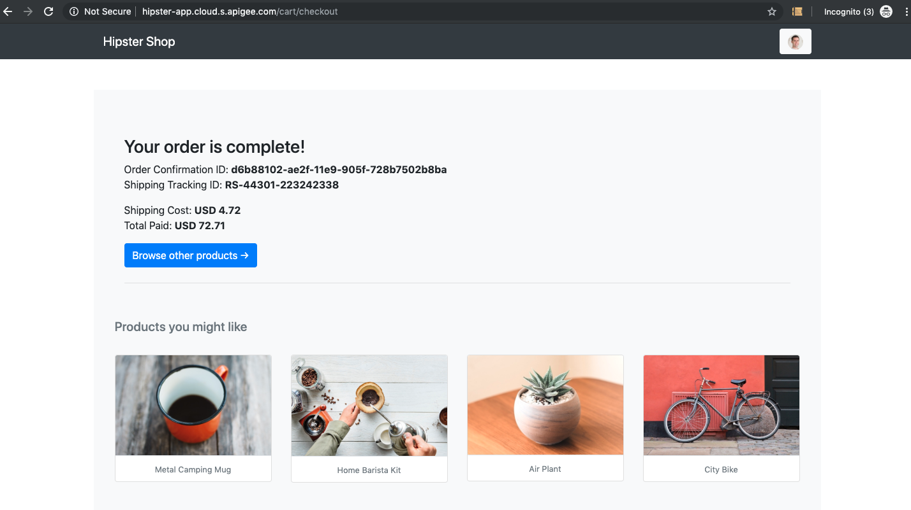

# Google Cloud Identity Platform Demo
This documentation provides details for how to configure and setup GCP Apigee & Identity Platform with the Hipster App.

* [Prerequisites](#prereqs)
  * [Setup GKE](#setup_gke)
  * [Setup Firebase](#setup_firebase)
  * [Install Istio](#install_istio)
  * [Install Hipster App](#install_hipster_app)
  * [Install Apigee Adapter](#install_apigee_adapter)
* [Sample Demos](#sample_demos)
  * [Demo Istio](#demo_istio)
  * [Demo Apigee](#demo_apigee)
  * [Demo GCIP](#demo_gcip)
* [Clean Up](#clean_up)
  * [Clean Up Demos](#clean_up_demos)
  * [Clean Up GKE](#clean_cluster)


## <a name="prereqs">Prerequisites</a>
These are the prerequisites for the Identity Platform Demo


### <a name="setup_gke">Setup GKE</a>
Run through all commands up to [Setup GKE](../README.md#setup-gke) for setting up the GKE environment and cluster.


### <a name="setup_firebase">Setup Firebase</a>
Login to Firebase [Console](https://console.firebase.google.com) and add a new project. Select your existing GCP project name and accept the TOS. Create a new web application and take note of the *Web Api Key*, *Auth Domain* and *Project ID* in the *Firebase SDK snippet*.


### <a name="install_istio">Install Istio</a>
Run through all commands up to and including [Install Istio](../README.md#install-istio) for setting up the Istio environment and cluster. Do not apply the *install/kubernetes/istio-demo.yaml* installation though since it does not include mTLS. If you accidentally apply it, you can always apply the next command over it:

Install Istio  and apply the mTLS configuration instead of the default instance:

		curl -L https://git.io/getLatestIstio | ISTIO_VERSION=1.1.7 sh -

		cd istio-1.1.7

		for i in install/kubernetes/helm/istio-init/files/crd*yaml; do kubectl apply -f $i; done

		kubectl apply -f install/kubernetes/istio-demo-auth.yaml

		watch kubectl get pods -n istio-system

		cd ..

Enable sidecar injection:

		kubectl label namespace default istio-injection=enabled

Apply the virtual servies, destination rules, frontend ingress gateway, and whitelist for external apis:

		kubectl apply -f istio-manifests/networking/

Verify everything was installed:
-_meshpolicy_ might be blank if mtls was not the default install

		kubectl get meshpolicy,virtualservice,destinationrule,serviceentry


### <a name="install_hipster_app">Install Hipster App</a>
Install the application:

		kubectl apply -f kubernetes-manifests/hipster-app.yaml

Verify everything is running:
_takes about a minute or two_

		watch kubectl get pods

Export FRONTEND_URL to navigate to Hipster App frontend:

	export FRONTEND_URL=http://$(kubectl get service frontend-external -o jsonpath='{.status.loadBalancer.ingress[0].ip}'); echo $FRONTEND_URL

Launch the FRONTEND_URL in a modern browser (Chrome/Safari/Firefox) and navigate around the Hipster Shop


### <a name="install_apigee_adapter">Install Apigee Adapter</a>
Run through the download commands for the [Install Apigee Adapter](../README.md#install-apigee-adapter) for setting up the Apigee Istio Mixer adapter. Save the *handler.yaml* file into this [directory](../istio-manifests/apigee/)

Apply all the Apigee Mixer configurations:

		kubectl apply -f istio-manifests/apigee

Verify the Apigee Mixer was installed:

		kubectl get pods -n istio-system | grep apigee-adapter


## <a name="sample_demos">Sample Demos</a>
Below are the sample demo instructions to showcase the Istio, Apigee, and Cloud Idenitity with Hipster App.

Export FRONTEND_URL to navigate to Hipster App

	export FRONTEND_URL=http://$(kubectl get service frontend-external -o jsonpath='{.status.loadBalancer.ingress[0].ip}'); echo $FRONTEND_URL

Launch the FRONTEND_URL in a modern browser (Chrome/Safari/Firefox) and navigate around the Hipster Shop. For OSX `open $FRONTEND_URL`
_This will succeed without any errors_


### <a name="demo_istio">Demo Istio</a>
We need to setup the Istio mtls Mesh Policy globally for the default namespace. More details are [here](https://istio.io/docs/tasks/security/authn-policy/#globally-enabling-istio-mutual-tls)

Verify one of the destination rules **trafficPolicy** is *DISABLED*

		kubectl get destinationrule.networking.istio.io/adservice -o yaml

Apply the mTLS mesh policy and mTLS destination rules:

		kubectl apply -f istio-manifests/networking/mtls

Verify everything was installed:

		kubectl get meshpolicy,virtualservice,destinationrule,serviceentry

Verify the destination rules **trafficPolicy** is *ISTIO_MUTUAL*

		kubectl get destinationrule.networking.istio.io/adservice -o yaml


### <a name="demo_apigee">Demo Apigee</a>
We need to setup the Apigee Istio Mixer adapter enforcement policies for AuthN/AuthZ. More details are [here](https://github.com/apigee/istio-mixer-adapter#configure-istio-for-the-apigee-adapter)

View the Apigee mixer rule:

		cat istio-manifests/apigee/rules/authorization-analytics-rule.yaml

Apply the Apigee mixer rule:

		kubectl apply -f istio-manifests/apigee/rules

Navigate around the Hipster Shop again in your browser.
_This will partially fail with HTTP 500 and HTTP 403 errors_


You will now need a valid Application and API Key to connect to the Hipster App services.

Generate a Developer and an API Product with the appropriate service names [example](https://docs.apigee.com/api-platform/istio-adapter/installation#get_an_api_key). You will need to add the following services to the API Product Istio Services:

```
cartservice.default.svc.cluster.local
currencyservice.default.svc.cluster.local
productcatalogservice.default.svc.cluster.local
recommendationservice.default.svc.cluster.local
shippingservice.default.svc.cluster.local
adservice.default.svc.cluster.local
checkoutservice.default.svc.cluster.local
paymentservice.default.svc.cluster.local
emailservice.default.svc.cluster.local
```

Create an Apigee application with the above API Product either in the Management UI or an Apigee developer portal [example](https://docs.apigee.com/api-platform/istio-adapter/installation#4_create_a_developer_app)

Copy the Apigee application Client ID above, add the Client ID to the Hipster App configuration, and click the **Save** button. `$FRONTEND_URL/config`


Navigate around the Hipster Shop again in your browser!
_This will succeed without any errors for the services you added to the API Product_


### <a name="demo_gcip">Demo GCIP</a>
Setup ure the up the Apigee Istio Mixer adapter enforcement policies for AuthN/AuthZ. More details are [here](https://github.com/apigee/istio-mixer-adapter#configure-istio-for-the-apigee-adapter)

View the Auth policy, service role, and service role binding configs:

		vi istio-manifests/rbac/checkoutservices-auth-rbac.yaml

Apply the Auth policy, service role, and service role binding to enforce RBAC on the checkout services:

		kubectl apply -f istio-manifests/rbac/

Verify everything was installed:

		kubectl get policies,serviceroles,servicerolebinding

Navigate around the Hipster Shop, add a product, and try to checkout!
_This will partially fail with HTTP 500 and HTTP 401 errors_



You will now need a valid JWT and google.com account to checkout anything from the Hipster App.

Show the GCP Identity providers and Firebase config in the GCP [console](https://console.cloud.google.com) and Firebase [console](https://console.firebase.google.com)

Copy the Firebase apiKey, authDomain, projectID to the Hipster App configuration, add the redirect URL, *$FRONTEND_URL/login*, and click the **Save** button. `$FRONTEND_URL/config`


Click the **login** button on the Hipster Shop and login with valid Google credentials.



Navigate around the Hipster Shop and try to checkout again in your browser!
_This will succeed without any errors for the valid Google account_




## <a name="clean_up">Clean Up</a>
Clean up the demos and cluster


### <a name="clean_up_demos">Clean Up Demos</a>
Clean up the RBAC, Apigee, mTLS configs:
_Need to re-apply the networking destination rules_

		kubectl delete -f istio-manifests/rbac
		kubectl delete -f istio-manifests/apigee
		kubectl delete -f istio-manifests/networking/mtls
		kubectl apply -f istio-manifests/networking

### <a name="clean_up_cluster">Clean Up Cluster</a>
Clean up the cluster to a fresh state

		kubectl delete -f kubernetes-manifests
		kubectl delete -f istio-1.1.7/install/kubernetes/istio-demo-auth.yaml

